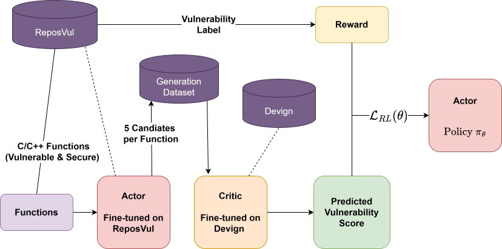

# Reinforcement Learning for Secure Code Generation
This project aims to investigate the effectiveness of applying reinforcement learning to secure code generation. Specifically, we use an offline actor-critic approach, where the [actor](https://huggingface.co/Salesforce/codet5-large) model learns to generate secure code through the guidance of a second [critic](https://huggingface.co/Salesforce/codet5-base) model. The critic detects vulnerabilities in actor-generated code and provides dense feedback, which in turn guides the actor towards generating more secure code.

## Overview 

We implement a setup using two transformer-based language models: a critic model trained on the [Devign](https://github.com/microsoft/CodeXGLUE/tree/main/Code-Code/Defect-detection) dataset to detect vulnerabilities and an actor model aligned to C/C++ code generation using a curated subset of the [ReposVul](https://github.com/Eshe0922/ReposVul) dataset. We use both models in a reinforcement learning pipeline, where the actor learns to generate secure code by leveraging the critic's feedback on its code output and a binary reward signal. Our results indicate that the critic can identify a reduction in the generated vulnerabilities.

## Critic Fine-Tuning Results
| Model | Accuracy | F1 |
|-------|-------|-------|
| CodeT5-base | 63.61 | 60.49 |

## Actor Fine-Tuning Results
| Model | CodeBleu |
|-------|-------|
| CodeT5-large | 95.22 | 

## Actor-Critic Approach Results
| Metric | Result |
|-------|-------|
| VRR | 27.27 |
+ VRR = Vulnerability Reduction Rate, the relative amount of vulnerabilities repaired according to the critic

